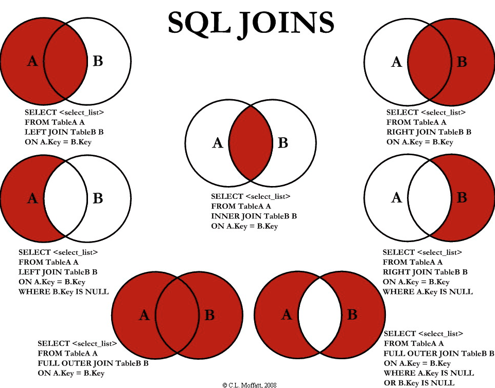

SQL = Structed Query Language -> Relational Database

Example of a query
```sql
SELECT DISTINCT column, AGG_FUNC(_column_or_expression_), … 
FROM mytable 
JOIN another_table 
	ON mytable.column = another_table.column 
	WHERE _constraint_expression_ 
	GROUP BY column 
	HAVING _constraint_expression_ 
	ORDER BY _column_ ASC/DESC 
	LIMIT _count_ OFFSET _COUNT_;
```

## SELECT
It's the basic statement ***what data*** we're looking for. 

```sql
SELECT * FROM mytable;

SELECT column_name, col_a, col_b FROM mytable;
```

#### AS
New name for a selected column
```sql
SELECT column AS better_column_name;

SELECT name AS employees;

SELECT particle_speed /2.0 AS half_particle_speed
FROM physics_data
WHERE ABS(particle_position) * 10.0 > 500;
```

#### Aggregate Functions
##### COUNT( * )
##### COUNT(column)
##### MIN(col)
##### MAX(col)
##### AVG(col)
##### SUM(col)
```sql
SELECT COUNT/ MIN /MAX / AVG / SUM (col)
FROM table_name;

-- Get latest data
WHERE system_date = MAX(system_date)
```

##### GROUP BY column
Grouping rows that have the same value

```sql
--For each grade, count the total students
SELECT COUNT(students)
FROM scores_report
GROUP BY grade

-- Grouping Apple stock by year, month
SELECT year, month, COUNT(*) AS count 
FROM tutorial.aapl_historical_stock_price 
GROUP BY year, month
```

##### HAVING 
***Additional condition for the group***, after ***GROUP BY*** condition
```sql
SELECT group_by_column, AGG_FUNC(_column_expression_) AS aggregate_result_alias, … 
FROM mytable 
WHERE _condition_ 
GROUP BY column 
HAVING _group_condition_;

--Grouping Apple stock by year, month, where HAVING max price > 400
SELECT year, month, MAX(high) AS month_high 
FROM tutorial.aapl_historical_stock_price 
GROUP BY year, month 
HAVING MAX(high) > 400 
ORDER BY year, month
```

#### CAST - Convert data
Use to convert Data type
```sql
SELECT 
	CAST(value_to_cast AS value_to_replace),
	CAST(25.65 AS varchar),				-- int to string
	CAST('2020-01-01' AS DATE)			-- string to date	
	CAST('2020-01-01' AS DATETIME)		-- string to datetime			
```

#### COALESCE - Handle NULL values
Use to handle `Null` values
```sql
SELECT
	COALESCE([col_name], [value_replace_to_null]) AS [col_name]   --col_name for new replaced value
	COALESCE(customer_name, 'Unknown') AS customer_name,
	COALESCE(description, '') AS description,
	COALESCE(AVG, 0)
FROM customer
LIMIT 1000;
```

#### CONCAT - Join strings
JOIN multiple values
```sql
--OPTION 1: CONCAT - can't handle NULL values
SELECT CONCAT('text1', 'text2', 'text3') AS combined_string
FROM my_table;

--OPTION 2: CONCAT_WS with seperator
--Can't use on BigQuery
SELECT CONCAT_WS('!@', col1, col2, col3) AS combined_string
FROM your_table;

--OPTION 3: STRING_AGG (recommended)
STRING_AGG(col_name, seperator)
STRING_AGG(DISTINCT col_name seperator)
STRING_AGG(col_name, seperator ORDER BY sort_expr [ASC|DESC])

--OPTION 4: ARRAY_CONCAT (to use on Bigquery)
  select 
    ARRAY_TO_STRING(
      ARRAY_CONCAT(
        col1, 	--col1 value
        IF(col2 IS NOT NULL AND is_sold_vamc = TRUE, ['col2'], []),    --If col1 .. then [value1], else [empty]
        IF(col3 IS NOT NULL AND col3 >= 3, ['col3'], [])
      ),
      '!@'  	--seperator   
    ) AS combined_string
  from my_table
```

#### `STRING_AGG` - Advanced Join strings
1. Simple join 1 column
```sql
-- Simple join
SELECT STRING_AGG(email,';') email_list FROM sales.customers;
-- a@gmail.com;b@gmail.com 

-- Order the result
SELECT STRING_AGG(email,';') email_list 
	WITHIN GROUP (ORDER BY email) email_list
FROM sales.customers;
```

2. Join multiple columns - STRING_AGG + CONCAT_WS
```sql
--Skip NULL value
SELECT STRING_AGG(CONCAT_WS('!@', col1, col2, col3)) AS combined_string
FROM our_table;
```

#### CASE-THEN-ELSE
IF-ELSE condition
```SQL
SELECT
	CASE 
		WHEN [condition_1] THEN [value_1]
		WHEN [condition_2] THEN [value_2]
		ELSE 'Not found'
	END AS [new column's name]
FROM table_name;
```

```sql
@set off_code = 1234
@set status = 'active'
@set created_id = 'NG001'
-- Case / and condition

SELECT
OFF_CODE,
	CASE
		--condition 1:
		WHEN OFF_CODE = ${off_code} AND OFF_CODE_STATUS = ${status} THEN 'Found by OFF code'
		--condition 2:
		WHEN USER_CODE = ${created_id} AND OFF_CODE_STATUS = ${status} THEN 'Found created_id'
		ELSE 'Not found'
	END AS condition_
FROM Employee.OFF_CODES oc
WHERE OFF_CODE = ${off_code};
```

## FROM
select data ***from which table***.
Use ***JOIN*** to combine tables

```sql
SELECT * FROM a_table;

SELECT old_col AS new_col_name
FROM a_long_table_name AS short_table
INNER JOIN sales
	ON short_table.id = sales.id;
```

## WHERE
Find the data matching with ***condition***.

```sql
SELECT col, col_a, col_b
FROM mytable
WHERE condition
	AND/OR another_condition
	AND/OR ...;
```

#### Numbers

|                           |                                            |                               |
| ------------------------- | ------------------------------------------ | ----------------------------- |
| Operator                  | Condition                                  | SQL Example                   |
| ***=, !=, <, <=, >, >=*** |                                            | col_name != 4                 |
| ***BETWEEN … AND …***     | within range of two values (inclusive)     | col_name BETWEEN 1.5 AND 10.5 |
| ***NOT BETWEEN … AND …*** | not within range of two values (inclusive) | col_name NOT BETWEEN 1 AND 10 |
| ***IN (…)***              | exists                                     | col_name IN (2, 4, 6)         |
| ***NOT IN (…)***          | does not exist                             | col_name NOT IN (1, 3, 5)     |
|                           |                                            |                               |
```sql
SELECT Title, Year
FROM movies
WHERE YEAR BETWEEN 2000 AND 2010
	AND Director = "Peter Docter"

-- if the number is even
WHERE YEAR % 2 = 0
```

#### ROUND(), FLOOR(), CEIL()
Làm tròn số

|Use it when you want to...|Function|
|---|---|
|Round normally (up or down based on decimal)|`ROUND()`|
|Always round **down** to the next lower integer|`FLOOR()`|
|Always round **up** to the next higher integer|`CEIL()` or `CEILING()`|
```sql
SELECT ROUND(123.456);  -- returns 123
SELECT FLOOR(3.4);  -- returns 3
```
#### Strings
|                  |                                                                                                       |                                                                         |
| ---------------- | ----------------------------------------------------------------------------------------------------- | ----------------------------------------------------------------------- |
| Operator         | Condition                                                                                             | Example                                                                 |
| ***=***          | Case sensitive exact string comparison (_notice the single equals_)                                   | col_name = 'abc'                                                        |
| ***!= or <>***   | Case sensitive exact string inequality comparison                                                     | col_name != 'abcd'                                                      |
| ***LIKE***       | Case insensitive exact string comparison                                                              | col_name LIKE 'ABC'                                                     |
| ***NOT LIKE***   | Case insensitive exact string inequality comparison                                                   | col_name NOT LIKE 'ABCD'                                                |
| ***%***          | Used anywhere in a string to match a sequence of zero or more characters (only with LIKE or NOT LIKE) | col_name LIKE '%AT%'  <br>(matches 'AT', 'ATTIC', 'CAT' or even 'BATS') |
| ***_***          | Used anywhere in a string to match a single character (only with LIKE or NOT LIKE)                    | col_name LIKE 'AN_'  <br>(matches 'AND', but not 'AN')                  |
| ***IN (…)***     | String exists in a list                                                                               | col_name IN ('A', 'B', 'C')                                             |
| ***NOT IN (…)*** | String does not exist in a list                                                                       | col_name NOT IN ('D', 'E', 'F')                                         |

when compare text, should use ***LIKE*** instead of = 
```sql

SELECT * FROM universities
WHERE Name LIKE "%Technology%"
	OR LOWER(Name) LIKE "%language%";
```

#### DATETIME

##### CAST - Convert data
Use to convert Data type
```sql
SELECT 
	CAST(value_to_cast AS value_to_replace),
	CAST(25.65 AS varchar),				-- int to string
	CAST('2020-01-01' AS DATE)			-- string to date	
	CAST('2020-01-01' AS DATETIME)		-- string to datetime			
```
##### Get current_date
```sql
SELECT current_date;
WHERE DATEDIFF(DAY, current_date, system_date) <= 30
```
##### Get Date different
```sql
-- BigQuery
-- Find data in the last 1 year (365 days)
SELECT * 
	FROM table_name
	WHERE date_diff(current_date, systm_dt, DAY) <= 356 

-- SQL 
-- Syntax: DATEDIFF(datepart, startdate, enddate) 
SELECT DATEDIFF(DAY, current_date, '2025-02-15') AS DaysDiff,
       DATEDIFF(MONTH, '2025-01-01', '2025-02-15') AS MonthsDiff,
       DATEDIFF(YEAR, '2020-01-01', '2025-02-15') AS YearsDiff;
```

##### DATE_ADD
Add extra date to the original date. Can be used in SELECT, WHERE
```sql
DATE_ADD(DATE '2025-11-27', INTERVAL 1 DAY)
DATE_ADD(DATE system_date, INTERVAL 1 MONTH)
DATE_ADD(DATE system_date, INTERVAL 1 YEAR)
```

#### IS / IS NOT NULL
```sql
SELECT column, another_column, … 
FROM mytable 
WHERE column IS/IS NOT NULL
AND/OR _another_condition_ ;
```


#### LOWER() / UPPER()
```sql
SELECT DISTINCT city 
FROM crime_scene_report 
WHERE LOWER(city) ='sql city';
```


## Filtering & Sorting

#### DISTINCT
remove duplicate rows
```sql
SELECT DISTINCT column, another_column, … 
FROM mytable 
WHERE condition(s);
```

#### EXCEPT DISTINCT
To select only distinct from 1st table/ remove duplicate
```sql
-- Returns rows from the 1st query that do not appear in the 2nd query, removing duplicates.
    select * from trg_data
    except distinct
    select * from src_data
```

#### ASC/DESC
***ASC (default)*** = ascending  small -> large
***DESC*** = descending large -> small

```sql
SELECT column, another_column, … 
FROM mytable 
WHERE _condition(s)_ 
ORDER BY column ASC/DESC;
```

#### LIMIT OFFSET
The ***LIMIT*** will limit the results, and ***OFFSET*** will specify **where to begin counting** the number rows from. 

```sql
SELECT column, another_column, … 
FROM mytable 
WHERE _condition(s)_ 
ORDER BY column ASC/DESC 
LIMIT num_limit OFFSET num_offset;
```

- Use ***LIMIT 5*** when looking for the first 5 movies
- Use ***OFFSET 5*** when looking for the next 5 movies
```sql
SELECT DISTINCT Title 
FROM movies 
ORDER BY Year DESC
LIMIT 5 (OFFSET 5);
```

## Multi-tables JOIN



#### Type of JOINS
- ***INNER JOIN / JOIN*** (default)
- FULL (OUTER) JOIN
- LEFT JOIN
- RIGHT JOIN

```sql
SELECT column, another_table_column, … 
FROM mytable 
INNER / LEFT / RIGHT / FULL OUTER JOIN another_table 
	ON mytable.id = another_table.id;
```

```sql
-- Join 2 tables, where international sales > domestic sales, order by rating
SELECT title, domestic_sales, international_sales
FROM movies
  JOIN boxoffice
    ON movies.id = boxoffice.movie_id
WHERE international_sales > domestic_sales
ORDER BY boxoffice.rating DESC;
```

```sql
-- Join 3 tables, find the similarities between high earners. Primary key is the ssn (social security number).
SELECT name, annual_income as income, 
gender, eye_color as eyes, hair_color as hair
FROM income i
JOIN person p
  ON i.ssn = p.ssn 
JOIN drivers_license dl
  ON p.license_id = dl.id
WHERE annual_income > 450000
```

## CTE - Common Table Expression
Use to Extract - Transform - Load data

### Compare CTE - Sub Query - Temp Table - View
**1. CTE**
	A temporary result. Easy to use, single query. 
	Only exists for the duration of the query -> Clean up memory. 

```sql
WITH SalesCTE AS (
	SELECT CustomerID, SUM(Total) AS TotalSales
	FROM Orders
	GROUP BY CustomerID
	)
SELECT * FROM SalesCTE WHERE TotalSales > 1000;
```
**2. Sub Query**
	A query nested inside another query (SELECT, FROM, WHERE, HAVING, etc.).
	Readability can suffer in complex cases.
```sql
SELECT CustomerID, CustomerName
FROM Customers
WHERE CustomerID IN (
    SELECT CustomerID FROM Orders WHERE Total > 1000
);
```

**3. Temp Table**
A table stored in tempdb (in SQL Server) or equivalent in other RDBMS, created with **#TempTable** or **CREATE TEMPORARY TABLE**.
Exists for the session or transaction.

```sql
CREATE TABLE #SalesTemp (
	CustomerID INT,
	TotalSales DECIMAL(10,2)
);

INSERT INTO #SalesTemp
SELECT CustomerID, SUM(Total)
FROM Orders
GROUP BY CustomerID;

SELECT * FROM #SalesTemp WHERE TotalSales > 1000;
```

**4. View**
A stored query that acts like a virtual table.
Exist permanently until dropped.

```sql
CREATE VIEW HighValueCustomers AS
	SELECT CustomerID, SUM(Amount) AS TotalSales
	FROM Sales
	GROUP BY CustomerID
	HAVING SUM(Amount) > 1000;
```

### Join 2 CTEs
```sql
-- CTE1
WITH cte1 AS (
    SELECT id, col1
    FROM table1
),
--CTE2
cte2 AS (
    SELECT id, col2
    FROM table2
)
SELECT 
    cte1.id,
    cte1.col1,
    cte2.col2
FROM cte1
--JOIN
JOIN cte2 ON cte1.id = cte2.id;
```